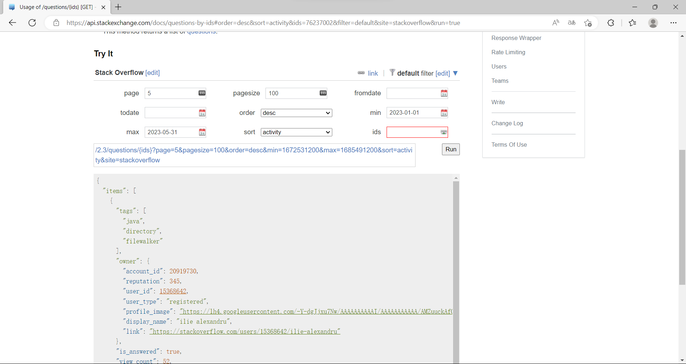
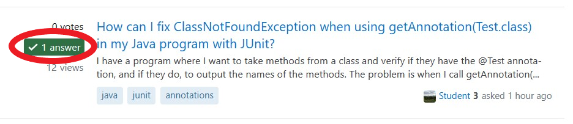

# Visualization of Stack Overflow Q&A Data
### CS209 Project Documentation
### 12110425 罗启航 12011710 董宇航

 

## 1. Method of Data Capture

First, we sign up for a developer account on StackOverflow and get the key. The key allows us to become legitimate StackOverflow developers and increase the number of times we can access the StackOverflow API.

Then we debug the query on the StackExchange web page. The web page provides a visual interactive page, which can easily adjust the query parameters and determine the query URL.

Next, we write a Java crawler that loops through the query urls and uses Google's Gson library to process the Json data. 

Finally, the data is saved in a PostgreSQL database.

## 2. Code Architecture Design

### 2.1 Front-end and Back-end Technology Stacks

For the backend, we wrote it in __Java__ and used __SpringBoot__ as the backend web server according to the project requirements. We use __Maven__ as a package manager for updating dependencies and building projects. As for the database of choice, we used __PostgreSQL__ because of its performance, its portability, and its syntax, which both of us are familiar with. In addition, in the Java API analysis part, we also use the open source __Jieba__ library. The library uses some NLP methods to analyze the content of the article to segment the words and sentences semantically, which can be used to match the API and count.

On the front end, since this project doesn't require a lot of front-end input data, we decided to use plain __HTML__ and call __ECharts__ to display the visualization. ECharts is a JavaScript library for visualizing charts with smooth animations and explicit user interaction. As a result, our frontend components are lightweight and fast, running instantly in any environment, without the need to build and deploy, compared to more complex frameworks like Vue and React.

### 2.2 Program flow

Our program runs as follows:

The front-end page clicks a button, calls a backend API, and sends a URL to the back-end server, which responds by getting the data from the database, performing statistical analysis, and sending the data to the front-end in the form of Json. Based on the data, the frontend calls ECharts, draws the statistics and displays them.

### 2.3 Description of Important Classes, Fields, and Methods

1) Controller class: responsible for handling the front-end request, as well as calling the back-end data operations, its important methods are:
 - getAnswerNumber: Gets the data for the "Questions and Answers" page and processes it, responding to the request "/getPercent"
 - getAccA: Fetches and processes the data from the "Approval and acceptance" page, and responds to the request "/AccA".
 - getTagPage: Gets the data needed for the "Tag" page and processes it, responding to "/tag" requests.
 - getUser: Fetches the data of the "user activity" page and processes it, responding to the request "/user"
 - getCountJavaAPI: fetches the data for the "JavaAPI" page and processes it, responding to the request "/countJavaAPI"

 - The implementation of these methods is very similar, the main method is to access the database to fetch the data from the question library and then use the TreeMap to calculate the data and sort the data using stream processing. The data of owner and answer are queried in the database according to the attributes inside the question.

2) DemoRestController class: mainly responsible for handling API requests. There are three API interfaces implemented in this class, and the corresponding methods are as follows
 - getQuestionByQuestionId: The url is /api/questionById, and the argument is the id of the question.Return the json sequence of questions corresponding to that id.
 - getQuestionByTag: This is at /api/questionByTags and takes tags as an argument.It will return a json of 10 questions with java and those tags.
 - getQuestionRelate: The url is /api/relate, which takes the id of the question and returns json data of the 10 most relevant questions to the question, as judged by stackexchange, with respect to the tag, question and answer.

3) Four classes in the "Model" module: Question, Answer, Comment, Owner, used to define the crawled data structure, including question_id, is_answered, view_count, etc.

4) Four interface classes in the "repository" module, which inherit from the JpaRepository class, correspond to the four classes of the Model, and provide interfaces for accessing the database, creating and managing the database, and performing data insertion and query.

5) The class QuestionService in the "serive" module, through calling the interface class in the repository, realizes the related operations of four databases. 
 - addAll: It can automatically crawl the data, split the crawled question into four data types: question, owner, answer, commet, and import them into the corresponding database.

## 3. Data Analysis and Insights

We crawled data such as questions, answers, comments, tags, user information, and performed several statistical analyses.

1) Regarding the number of responses, we found that only 40% of the questions had answers, and more than half of them had only one response.

This shows that it is difficult to only rely on StackOverflow to get answers and debug. A better approach might be to query multiple Internet forums or official documents at the same time.

2) For the adoption of questions, we find that the adoption of questions is greatly affected by time. The closer the time between the answer and the question is, the higher the adoption rate is, and up to 86% of the questions are accepted within a day. We suspect that this may be due to StackOverflow's push algorithm, which preferentially pushes recent unaccepted questions to respondents. These questions get a lot of traffic and exposure, so they get accepted answers quickly.

This means that if I ask a question on StackOverflow and it goes unanswered for a long time, I should reask the question, which is more likely to get accepted quickly.

3) Regarding the relationship between approval and adoption, we found that 90% of the responses adopted by the questioner also received the most approval from other users.

This means that the probability of being the correct solution to the problem is quite high. When browsing StackOverflow, looking for the __"Accept" mark__, the green checkmark in the image below, often leads to faster answers.

4) For user activity, we find that most users only post one response or comment. Active users who post a large number of responses or comments have a smaller number of users and a smaller total number of responses.

This shows that StackOverflow is a public forum, everyone can speak freely on it, and its discourse power is not monopolized by a few elites. In other words, these answers and comments are inevitably good and bad, and we should not easily believe or directly copy these answers, but should do further confirmation and verification.

5) For the relationship between responses and comments, we find that for users as a whole, they post more comments than answers, and the number of users who post multiple comments is also more than the number of users who post multiple answers. However, for questions, there are far more questions without comments than questions without answers.

In this regard, we believe that the low number of responses is related to the rule of the StackOverflow forum that a new user can post a maximum of one response every 30 minutes. People are willing to make the first answer to the question that has not been answered, but for comments, people tend to like to have a heated discussion with others under the question of the existing comment, so that the question that has neither answer nor comment will be ignored.

This shows that if we want to have a heated discussion with others on StackOverflow, it is better to choose a question that has more answers and comments.

In summary, here are a few tips for getting the most out of StackOverflow forums:
- Reask questions when they have been unanswered for a long time.
- Prioritize responses with a green "Accept" mark.
- Do not easily believe or directly copy an answer, but make further confirmation and verification.
- Discuss questions with others that have already been answered and commented on.
- Do not rely on StackOverflow. When you can't find an answer, consult other Internet forums or official documentation.