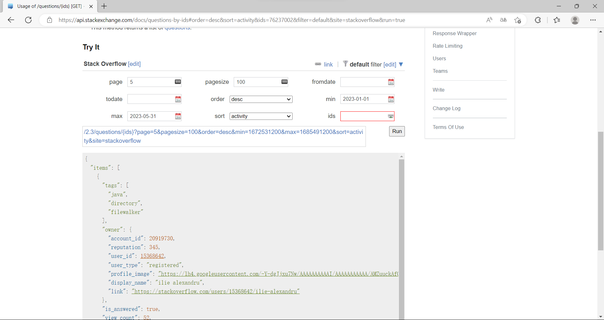
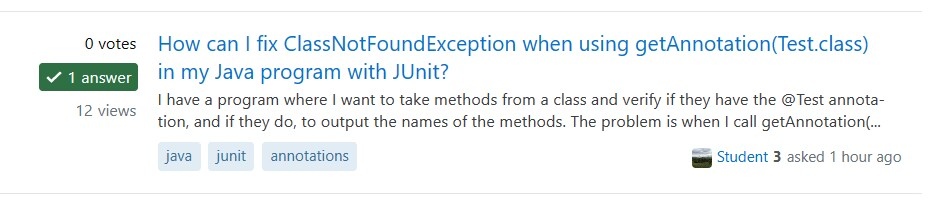

# Visualization of Stack Overflow Q&A Data
### CS209 Project Documentation
### 12110425 罗启航 12011710 董宇航

 

## 1. Method of Data Capture

首先，我们在StackOverflow注册开发者账号并获取密钥。密钥可以让我们成为合法的StackOverflow开发者，提高访问StackOverflow API次数的上限。

然后，我们在StackExchange网页上调试查询语句。该网页提供可视化的可交互页面，能够方便快捷地调整查询参数，确定查询的URL。

接下来，我们使用Java编写爬虫程序，循环访问查询URL，使用Google的Gson库处理爬取到的Json数据，并保存在PostgreSQL数据库。

## 2. Code Architecture Design

### 2.1 Front-end and Back-end Technology Stacks

后端方面，根据项目要求，我们以Java编写，并使用SpringBoot作为后端网络服务器。我们使用Maven作为包管理工具，以便更新依赖项和构建工程。在数据库的选择上，我们使用PostgreSQL，因为其性能较好，操作便携，且我们两人都较熟悉其语法。此外，在Java API分析部分，我们还使用了开源的Jieba库。该库通过一些NLP方法，分析文章内容，从而按照语义切割词句，用于匹配API并统计。

前端方面，由于本项目无需过多的前端输入数据，我们决定使用纯HTML，并调用ECharts显示可视化图表。ECharts是一个用于可视化的JavaScript库，其图表可以实现流畅的动画与反馈明确的用户交互。由此一来，我们的前端组件轻巧、运行迅速，相比较为复杂的Vue和React框架，可以在任何环境下立即运行，而无需构建和部署。

### 2.2 Program flow

我们的程序运行流程如下：

前端网页点击按钮，调用某个后端API，发送一条URL给后端服务器，服务器对应的处理函数做出响应：首先从数据库获取数据，然后进行统计分析，接着将数据以Json形式发给前端；前端根据数据，调用ECharts，绘制统计图表并显示。

### 2.3 Description of Important Classes, Fields, and Methods

1) Controller类：负责处理前端的请求，以及调用后端数据的运算，其重要方法有：
 - getAnswerNumber:         获取“问题与回答”页面的数据并处理，响应的请求为“/getPercent”。
 - getAccA：                获取“赞同与采纳”页面的数据并处理，响应的请求为”/AccA“。
 - getTagPage:              获取“Tag”页面所需的数据并处理，响应的请求为“/tag”。
 - getUser:                 获取“用户活跃度”页面的数据并处理，响应的请求为“/user”
 - getCountJavaAPI：        获取“Java API”页面的数据并处理，响应的请求为“/countJavaAPI”

 - 这几个方法的实现大同小异，主要是通过访问数据库获取question库的数据然后使用TreeMap的方式统计数据，并进行使用流处理的方式进行排序。期间需要用到的owner和answer的数据，根据question内部的属性在数据库中查询。

2) DemoRestController类：主要负责处理API请求，该类中实现了三个API接口，其对应的方法分别为
 - getQuestionByQuestionId：url为/api/questionById，需要的参数为question的id，返回该id对应的question的json序列。
 - getQuestionByTag: url为/api/questionByTags，需要的参数为tags，其会返回包含java和这些tag的10条question的json数据。
 - getQuestionRelate：url为/api/relate，需要的参数为question的id，该api会返回与这个question相关性最强的10条question的json数据，这个相关性由stackexchange判断，与标签，问题和答案有关。

3) Model模块下的四个类：Question, Answer, Comment, Owner，用于定义爬取的数据结构，包括question_id, is_answered, view_count等等
	

4) repository模块内的4个接口类，继承了JpaRepository类，分别对应了Model的4个类，提供了用于访问数据库，进行数据库创建和管理，执行数据插入和查询的接口。

5) serive里的类QuestionService，通过调用repository内的接口类，实现对4个数据库的相关操作。其中的addAll方法能自动爬取数据，将爬到的question拆成question，owner，answer，commet四种数据类型，导入到对应的数据库中。

## 3. Data Analysis and Insights

我们爬取了问题、回答、评论、tag、用户信息等数据，并进行了多项统计分析。

1) 对于问题的回答数量，我们发现，仅有40%的问题有回答，其中半数以上仅有1个回答。

这说明，仅依赖StackOverflow获取解答，进行debug，是较为困难的。同时查询多个互联网论坛或官方文档，可能是更好的方法。

2) 对于回答的采纳情况，我们发现，问题采纳状况受时间影响极大，回答与提问的时间越接近，采纳率越高，高达86%的问题在一天内获得采纳。我们猜测，这可能是因为StackOverflow的推送算法，会优先向回答者推送近期的未采纳问题。这些问题由于得到了较高的流量和曝光，因此快速获得了受采纳的回答。

这说明，如果我在StackOverflow的提问，长时间无人问津，那么，我应当重新提问，这更可能快速获得受采纳的回答。

3) 对于赞同与采纳的关系，我们发现，被提问者采纳的回答，有90%也获得了其他用户最多的赞同。

这说明，其是问题正确解答的概率相当大。我们在浏览StackOverflow时，认准“采纳”标记，即下图的绿色对勾，往往可以更快速地获取解答。

4) 对于用户的活跃度，我们发现，大多数用户都只发表了一条回答或评论。发表大量回答或评论的活跃用户，其人数和回答总量都较少。

这说明，StackOverflow是一个大众论坛，人人都可以在其上自由发言，其话语权并没有被少数精英垄断。换言之，这些回答和评论难免良莠不齐，我们不应轻易相信、直接照搬这些答案，而是应当做进一步的确认和求证。

5) 对于回答与评论的关系，我们发现，对用户整体而言，其发表的评论比回答更多，发表多条评论的用户人数也多于发表多条回答的用户人数。然而，对于问题而已，没有评论的问题，占比远远超过没有没有回答的问题。

对此，我们认为，回答数量少，与StackOverflow论坛的规定有关，即新用户每30分钟最多发表一条回答。人们愿意为尚无答案的问题做出第一个回答，但是，对于评论，人们往往喜欢在已有评论的问题下，与他人热烈讨论，因此，既无回答也无评论的问题，就会无人问津，门可罗雀。

这说明，我们如果想要在StackOverflow中与他人热烈讨论，最好选择已有较多回答、评论的问题。

总而言之，想要较好的使用StackOverflow论坛，我们总结出了以下几个技巧：
 - 在提问长时间无人问津时，重新提问。
 - 优先查看带有绿色对勾“采纳”标记的回答。
 - 不应轻易相信、直接照搬某一回答，而是应当做进一步的确认和求证。
 - 在已有较多回答、评论的问题的问题下与他人讨论。
 - 不依赖StackOverflow，找不到答案时，查询其他互联网论坛或官方文档。